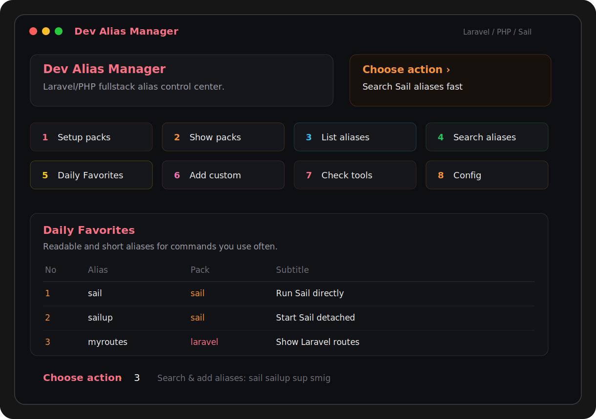

# Dev Alias Manager

Dev Alias Manager is a Laravel/PHP fullstack alias manager for Bash and Zsh.

It installs shell functions for Laravel, Sail, Composer, npm/Vite, Docker, Git, GitHub CLI, Pest, Pint, Rector, PHPStan, Linux helpers, security checks, and project workflow commands.

DAM does not install Docker, PHP, Composer, Node, Laravel, Sail, or third-party developer tools. It only installs aliases, help screens, colorful terminal UI, and your personal Daily Favorites list.

## What You Get

- Laravel-style setup prompts with checkbox screens when `dialog` or `whiptail` is available.
- Automatic zsh/bash detection during install.
- Colorful icon tables for alias lists, categories, searches, and Daily Favorites.
- Conflict checks before aliases are saved, with options to skip/delete the DAM alias, replace/shadow the existing command, or rename the DAM alias.
- Alias packs with subtitles: Laravel, Sail, Docker, Frontend, PHP/Composer, Git, GitHub, Quality, Security, Linux, and Workflow.
- Sail-aware commands: Laravel aliases use Sail automatically when `./vendor/bin/sail` exists.
- Personal Daily Favorites: add one or many aliases by name, search first, or choose many with checkboxes.

## Preview



## Install

```bash
git clone https://github.com/vardanm1993/Dev-Alias-Manager.git
cd Dev-Alias-Manager
chmod +x install.sh uninstall.sh
./install.sh
```

The installer asks where to add the DAM source block:

```text
1) Auto detected
2) Zsh only
3) Bash only
4) Both zsh and bash
0) Cancel install
```

Before setup installs packs, DAM checks whether any planned alias name already exists on your computer. If a selected alias conflicts, setup asks what to do:

```text
s = skip/delete the DAM alias
r = replace/shadow the existing command
n = rename the DAM alias
```

For automation, you can still force a target shell:

```bash
./install.sh --zsh
./install.sh --bash
./install.sh --both
```

For the best checkbox UI on Ubuntu/Debian:

```bash
sudo apt install dialog
```

If `dialog` is missing, DAM tries `whiptail`. If both are missing, it uses a plain text menu where you can choose aliases with space-separated input.

## First Run

After install, reload the terminal when prompted. If you skipped reload:

```bash
source ~/.zshrc
# or
source ~/.bashrc
```

Then start with:

```bash
dam               # open interactive control center
dam wizard        # checkbox install for alias packs
dam list          # colorful table of installed aliases
dam search sail   # search aliases by name, pack, command, or subtitle
dam daily choose  # checkbox picker for your Daily Favorites
dam help          # help center
dam check         # environment check
```

## Daily Favorites

Daily Favorites are only the aliases you choose. DAM does not install a default Daily list.

```bash
dam daily                 # open Daily menu
dam daily choose          # choose many with checkbox UI
dam daily search route    # search before adding
dam daily add sup art     # add one or many aliases
dam daily remove myroutes # remove one alias
dam daily delete sup art  # delete one or many aliases
dam daily delete 1 3      # delete by row number
dam daily up myroutes     # move one row up
dam daily down 2          # move row 2 down
dam daily move sup 1      # move alias to position 1
dam daily run             # run Daily aliases in order
dam daily clear           # empty the list
```

The checkbox chooser shows every installed alias with its pack subtitle, for example Docker aliases together, Sail aliases together, Laravel aliases together, and so on.

## Alias Packs

| Pack | What It Covers | Examples |
| --- | --- | --- |
| Laravel | Artisan, routes, database, queues, logs, generators, Sail install | `art`, `sailinstall`, `myroutes`, `dbmigrate`, `mkc`, `mkm`, `logs` |
| Sail | Sail lifecycle, Artisan, Composer, npm, and quality tools through Sail | `sup`, `sdown`, `sart`, `smig`, `snpm`, `spest`, `spint`, `srector`, `sstan`, `sqa` |
| Frontend | npm and Vite workflows | `ni`, `nrd`, `nrb`, `nrt`, `nrl`, `npreview` |
| PHP / Composer | PHP and Composer workflows | `phpv`, `phpm`, `ci`, `cu`, `creq`, `caudit`, `coutdated` |
| Quality | Pest, Pint, Rector, PHPStan | `pint`, `pest`, `rcheck`, `rfix`, `stan`, `qa` |
| Docker | Docker Compose and cleanup | `dcomp`, `dcu`, `dcub`, `dcd`, `dcl`, `dps`, `dprune` |
| Git | Daily Git commands | `gst`, `ga`, `gaa`, `gcm`, `gcam`, `gp`, `gpf` |
| GitHub | GitHub CLI helpers | `ghpr`, `ghprv`, `ghprs`, `ghruns`, `ghwatch` |
| Linux | Terminal and Ubuntu helpers | `cls`, `update`, `cleanup`, `ports`, `disk`, `mem` |
| Security | Laravel project safety checks | `secenv`, `seckey`, `secaudit`, `secnpm`, `secperms` |
| Workflow | Project start, stop, doctor, and quality flows | `doctor`, `start`, `stop`, `devflow`, `checkall` |

Install a single pack later:

```bash
dam preset laravel
dam preset sail
dam preset docker
dam preset fullstack
```

## Laravel And Sail Examples

```bash
sailinstall          # php artisan sail:install, or Sail artisan if Sail exists
sup                  # ./vendor/bin/sail up -d
sart migrate         # ./vendor/bin/sail artisan migrate
smig                 # ./vendor/bin/sail artisan migrate
scomposer install    # ./vendor/bin/sail composer install
snpm run dev         # ./vendor/bin/sail npm run dev
spint                # ./vendor/bin/sail php vendor/bin/pint
srector              # ./vendor/bin/sail php vendor/bin/rector process
sqa                  # quality pipeline through Sail
myroutes             # route:list
dbfresh              # migrate:fresh --seed
logs                 # tail storage/logs/laravel.log
qa                   # Pint, Rector, PHPStan, Pest, and frontend checks
```

## Manage Aliases

```bash
dam add hello system 'echo hello' 'Print hello'
dam add-to laravel mylogs raw 'tail -f storage/logs/laravel.log' 'Follow Laravel log'
dam change quality pest vendor 'pest' 'Run Pest tests'
dam remove hello
dam search pest
dam help alias pest
```

Alias kinds:

| Kind | Runs |
| --- | --- |
| `artisan` | `php artisan` locally, or Sail artisan when Sail exists |
| `npm` | `npm`, or Sail npm when Sail exists |
| `composer` | Composer, or Sail composer when Sail exists |
| `php` | PHP, or Sail PHP when Sail exists |
| `vendor` | tools in `./vendor/bin` |
| `system` | normal shell commands |
| `raw` | advanced shell workflows |

## Configuration

Open config:

```bash
dam config
```

Defaults:

```bash
DAM_SAIL_BIN=./vendor/bin/sail
DAM_ARTISAN_BIN=artisan
DAM_VENDOR_BIN=./vendor/bin
DAM_AUTO_SAIL=1
```

Disable Sail auto-detection for one command:

```bash
USE_SAIL=0 myroutes
```

## Update Or Reinstall

Run the installer again. Existing aliases, Daily Favorites, and config are kept.

```bash
./install.sh
```

If DAM is already installed, the installer asks whether to delete old DAM data first. Press Enter or `n` to keep/update, or type `y` for a fresh install.

Fresh reinstall:

```bash
./install.sh --clean
```

## Verify

```bash
make verify
```

The verification script checks Bash syntax, Zsh syntax when available, alias behavior, Daily Favorites, and installer behavior with a custom `DAM_HOME`.

## Uninstall

Remove shell source blocks and keep config:

```bash
./uninstall.sh
```

Remove shell source blocks and config:

```bash
./uninstall.sh --purge
```

## License

MIT
